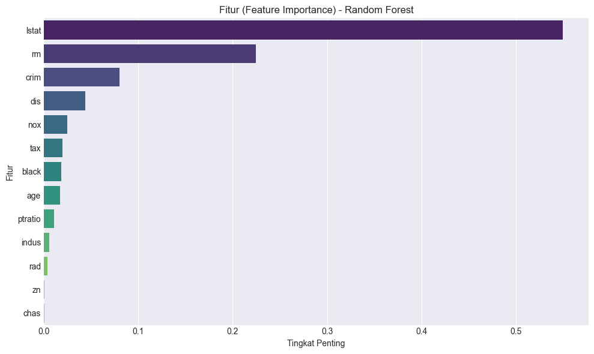

# Proyek Prediksi Harga Rumah Boston

<div align="center">
  
</div>

Proyek ini adalah solusi untuk tantangan "Big Data Challenge" yang berfokus pada analisis dan pembangunan model prediksi harga rumah. Dataset yang digunakan adalah Boston Housing Dataset dan dianalisis menggunakan Python dengan library Pandas, Scikit-learn, Matplotlib, dan Seaborn.

## Tujuan Proyek

Tujuan utama dari proyek ini adalah:

1. Melakukan analisis data eksplorasi (EDA) untuk memahami karakteristik dataset.
2. Mempersiapkan data dengan penanganan *skewness* (kemiringan data).
3. Membangun dan melatih dua jenis model regresi: Regresi Linear dan Random Forest Regressor.
4. Mengevaluasi performa kedua model dan membandingkannya.
5. Mengidentifikasi fitur-fitur yang paling berpengaruh terhadap harga rumah.

## Dataset

Dataset yang digunakan adalah Boston Housing Dataset, yang berisi informasi tentang berbagai faktor demografi dan lingkungan di area Boston, serta nilai median harga rumah. Beberapa kolom penting dalam dataset meliputi:

- `CRIM`: Tingkat kejahatan per kapita.
- `ZN`: Proporsi lahan residensial berzona besar.
- `INDUS`: Proporsi luas bisnis non-ritel per kota.
- `CHAS`: Indikator berbatasan dengan Sungai Charles (1 jika ya, 0 jika tidak).
- `NOX`: Konsentrasi oksida nitrat (polusi udara).
- `RM`: Rata-rata jumlah kamar per hunian.
- `AGE`: Proporsi unit yang dibangun sebelum tahun 1940.
- `DIS`: Jarak tertimbang ke lima pusat ketenagakerjaan Boston.
- `RAD`: Indeks aksesibilitas ke jalan raya radial.
- `TAX`: Nilai pajak properti penuh per $10.000.
- `PTRATIO`: Rasio siswa-guru di sekolah setempat.
- `BLACK`: Proporsi penduduk kulit hitam berdasarkan formula tertentu.
- `LSTAT`: Persentase status penduduk berpenghasilan rendah.
- `MEDV`: **Variabel target**: Nilai median rumah yang ditempati pemilik (dalam $1000).

## Tahapan Proyek

Proyek ini melewati beberapa tahapan utama:

### 1. Pemuatan dan Ikhtisar Data

Memuat dataset menggunakan Pandas dan memeriksa 5 baris pertama, bentuk data, nama kolom, dan keberadaan nilai yang hilang.

### 2. Analisis Data Eksplorasi (EDA)

Memvisualisasikan matriks korelasi menggunakan heatmap untuk memahami hubungan antar fitur dan mengidentifikasi fitur yang paling berkorelasi dengan harga rumah (`MEDV`). Ditemukan bahwa `LSTAT` (persentase penduduk berpenghasilan rendah) dan `RM` (jumlah kamar) memiliki korelasi terkuat dengan `MEDV`.

### 3. Feature Engineering - Perbaikan Skewness

Mengidentifikasi fitur numerik yang memiliki kemiringan (skewness) tinggi dan menerapkan transformasi logaritmik (`np.log1p`) untuk mengurangi kemiringan tersebut. Langkah ini penting untuk membantu model bekerja lebih optimal. Beberapa fitur yang ditransformasi antara lain `crim`, `zn`, `dis`, `rad`, `lstat`, dan `medv`. Fitur biner seperti `chas` dikecualikan dari transformasi.

### 4. Pembagian Data (Train-Test Split)

Membagi dataset menjadi set pelatihan (training set) dan set pengujian (testing set) dengan rasio 80:20 menggunakan `train_test_split`. Data pelatihan digunakan untuk melatih model, sedangkan data pengujian digunakan untuk mengevaluasi performa model pada data yang belum pernah dilihat sebelumnya.

### 5. Pembangunan dan Evaluasi Model Regresi Linear

Melatih model `LinearRegression` pada data pelatihan dan mengevaluasi performanya menggunakan metrik R² Score dan RMSE (Root Mean Squared Error) pada data pelatihan dan pengujian.

### 6. Pembangunan dan Evaluasi Model Random Forest Regressor

Melatih model `RandomForestRegressor`, sebuah model ensemble yang lebih kompleks, dan membandingkan performanya dengan Regresi Linear menggunakan metrik yang sama. Selain itu, dianalisis juga *feature importance* untuk mengidentifikasi fitur-fitur paling berpengaruh menurut model Random Forest.

## Hasil dan Perbandingan Model

Berikut adalah ringkasan performa kedua model:

| Metrik          | Linear Regression | Random Forest |
|:----------------|:------------------|:--------------|
| R² (Training)   | 0.8036            | **0.9783**    |
| RMSE (Training) | 0.1726            | **0.0574**    |
| R² (Testing)    | 0.7570            | **0.8397**    |
| RMSE (Testing)  | 0.1836            | **0.1491**    |

Dari tabel di atas, terlihat jelas bahwa **Random Forest Regressor memberikan performa yang lebih unggul** dibandingkan Linear Regression, baik pada data pelatihan maupun data pengujian. Ini menunjukkan kemampuan Random Forest dalam menangkap hubungan yang lebih kompleks dalam data.

### Fitur Paling Berpengaruh (Random Forest Importance)

Berdasarkan `RandomForestRegressor`, fitur-fitur yang paling berpengaruh terhadap prediksi harga rumah (`MEDV`) adalah:

1. `lstat` (Persentase penduduk berpenghasilan rendah)
2. `rm` (Rata-rata jumlah kamar per hunian)
3. `crim` (Tingkat kejahatan per kapita)
4. `dis` (Jarak ke pusat ketenagakerjaan)
5. `nox` (Konsentrasi oksida nitrat)
   ... dan seterusnya.

Ini sesuai dengan intuisi, di mana faktor sosial ekonomi dan properti itu sendiri menjadi penentu utama harga rumah.

## Kesimpulan

Proyek ini berhasil membangun dan mengevaluasi model prediksi harga rumah di Boston. `RandomForestRegressor` terbukti menjadi pilihan yang lebih baik untuk dataset ini, menunjukkan performa yang kuat dan kemampuan untuk mengidentifikasi fitur-fitur kunci yang mempengaruhi harga properti.

## Bagaimana Cara Menjalankan Proyek Ini?

1. **Clone repositori ini:**
   ```bash
   git clone git@github.com:KMoex-HZ/RegressionBostonHousing-BDC.git
   cd nama-repo-proyek-anda
   ```

2. **Instal library yang dibutuhkan:**
   ```bash
   pip install pandas numpy scikit-learn matplotlib seaborn
   ```

3. **Pastikan file `data.csv` (Boston Housing Dataset) ada di direktori yang sama** dengan script Python Anda.

4. **Jalankan script Python** di lingkungan pilihan Anda (misalnya Jupyter Notebook, Google Colab, atau sebagai script `.py`).
